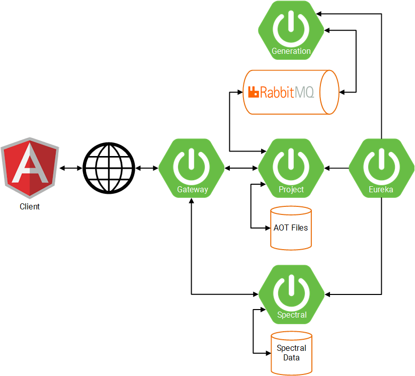

# ALMA Design Study Prototype Services
The ALMA Observing Tool (OT) is an application for the used for the preparation and submission of ALMA Phase 1 (observing proposal) and Phase 2 (telescope runfiles for accepted proposals) materials. The present ALMA-OT is a desktop Java application, running (almost) wholly on the users own machine.The exceptions are when submitting/retrieving proposals and when querying external databases and archives (such as name resolvers and image servers).

This prototype backend uses a microservice architecture to supply clients with required data. This architecture has 
been used to apply modularity, improving stability, scalability, and ease of development. The services are managed using 
Netflix OSS utilities and built using Java Spring.
## Architecture


The current structure of the services is described above. Netflix Eureka is used as a discovery service to identify 
services and for reference by the edge service. The edge service uses Netflix Zuul to provide access to the services 
despite being dynamically assigned ports.

Docker and docker-compose are used to build and run the services. Each service running in different containers. This 
allows easy, system-independent, building and running and mirrors AWS EC2 instances.

## Routes
Route                              | Destination
:----------------------------------|:-----------------------------------------------
http://localhost:8761              | Eureka dashboard
http://localhost:8080/routes       | List of available routes and their destinations
http://localhost:8080/api          | Accesses the API
http://localhost:8080/api/spectral | Accesses the spectral service API
http://localhost:8080/api/project  | Accesses the project service API

## API
### Project Service
Route     | Params                 | Result
:---------|:-----------------------|:----------------------------------------------------
/ping     | None                   | Basic text result from service
/projects | None                   | `List<ObsProject>` of all stored projects
/proposal | **String** proposalRef | `ObsProposal` matching the supplied entity reference

### Spectral Service
 Route             | Params                                     | Result
:------------------|:-------------------------------------------|:---------------------------------------------
/ping              | None                                       | Basic text result from service
/splatalogue       | None                                       |`List<SpectralLine>` of the stored splatalogue
/spectrum/{octile} | **int** The desired octile of the spectrum | `int[][][]` of Spectral data

## Usage
### Prerequisites
To run the microservices the following are required:
- [Maven](https://maven.apache.org/)
- [Docker](https://www.docker.com/)
- [Docker-compose](https://docs.docker.com/compose/)

### Process
Clone the repository

CD into the repository
```
cd microservices
```
Build with Maven, this will also generate a Dockerfile for each service
```
mvn clean package
```
Bring the services up
```docker
docker-compose up 
```
The services should be accessible after a short while

To stop the services if they're in the background
```docker
docker-compose down
```

